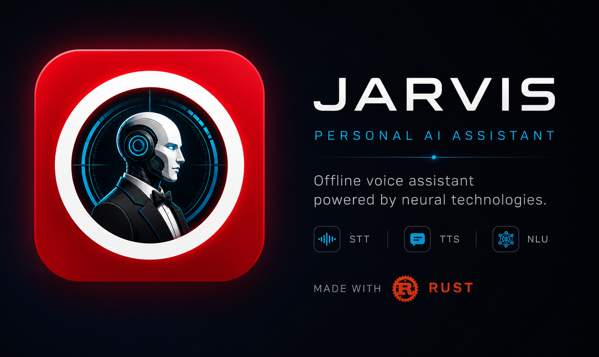

# JARVIS Voice Assistant



`Jarvis` is a 100% offline voice assistant built as an experiment using neural networks for **STT / Wake Word / NLU / Intent Classification** and more.

**Core goals:**
- 100% offline — no cloud, no telemetry
- Open source — full transparency
- No data collection — your privacy is respected

**Stack:** 🦀 [Rust](https://www.rust-lang.org/) + ❤️ [Tauri v2](https://tauri.app/) on the backend, ⚡️ [Vite](https://vitejs.dev/) + 🛠️ [Svelte](https://svelte.dev/) on the frontend.

---

## Architecture

The project is a Cargo workspace with four crates:

| Crate | Role |
|---|---|
| `jarvis-core` | Core library — audio, STT, wake word, intent, IPC, commands, voices |
| `jarvis-app` | Main backend daemon — voice pipeline, IPC WebSocket server on `ws://127.0.0.1:9712` |
| `jarvis-gui` | Tauri GUI — settings window, connects to `jarvis-app` via IPC |
| `jarvis-cli` | CLI utility |

`jarvis-gui` launches `jarvis-app` automatically on startup. They communicate over a local WebSocket (port 9712).

---

## Neural Networks

| Task | Library | Status |
|---|---|---|
| Speech-To-Text | [Vosk](https://github.com/alphacep/vosk-api) via [vosk-rs](https://github.com/Bear-03/vosk-rs) | Active |
| Wake Word | [Vosk](https://github.com/alphacep/vosk-api) (grammar-based) | Active (slow) |
| Wake Word | [Rustpotter](https://github.com/GiviMAD/rustpotter) | WIP |
| Wake Word | [Picovoice Porcupine](https://github.com/Picovoice/porcupine) | Requires API key |
| Intent Classification | MiniLM L6v2 / L12v2 ONNX via [fastembed](https://github.com/Anush008/fastembed-rs) | Active |
| Slot Extraction | [GLiNER](https://github.com/urchade/GLiNER) | Optional / WIP |
| TTS | — | Not implemented |

---

## Supported Languages

| Language | STT Model | Wake Word |
|---|---|---|
| Russian | `vosk-model-small-ru-0.22` | Vosk grammar |
| English | `vosk-model-en-us-0.22-lgraph` | Vosk grammar |
| Ukrainian | `vosk-model-small-uk-v3-nano` | Vosk grammar |

---

## Prerequisites

- [Rust](https://rustup.rs/) 1.75+
- [Node.js](https://nodejs.org/) 18+ with npm
- [Python](https://python.org/) 3.8+ (for `post_build.py`)
- Tauri CLI: `cargo install tauri-cli --version "^2"`
- Vosk models placed in `resources/vosk/`
- Native libraries in `lib/windows/amd64/` (included in repo): `libvosk.dll`, `libpv_recorder.dll`, etc.

---

## How to Run (Development)

### Step 1 — Install frontend dependencies

```bash
cd frontend
npm install
```

### Step 2 — Copy native libraries and resources to build output

Run from the workspace root:

```bash
python post_build.py
```

This copies `libvosk.dll`, `libpv_recorder.dll` and all resources into `target/debug/`.

### Step 3 — Start the Vite dev server

Run from `frontend/` and keep it running in the background:

```bash
cd frontend
npm run dev
# Vite starts on http://localhost:1420
```

### Step 4 — Build and launch the Tauri GUI

Run from `crates/jarvis-gui/`:

```bash
cd crates/jarvis-gui
cargo tauri dev --config '{"build":{"beforeDevCommand":""}}'
```

> The `--config` flag disables the built-in `beforeDevCommand` because the Vite server is already running from Step 3.
> First build will take 10–15 minutes as all dependencies compile from scratch.

### Step 5 — Launch jarvis-app (backend)

`jarvis-gui` launches `jarvis-app.exe` automatically from the same directory on startup via the **Start** button in the GUI. No manual launch needed.

If you want to run the backend standalone:

```bash
cd target/debug
./jarvis-app.exe
```

---

## How to Build (Release)

```bash
cd frontend
npm install
npm run build

cd ../crates/jarvis-gui
cargo tauri build
```

After the build, run `python post_build.py --force` from the workspace root to copy native libraries into `target/release/`.

---

## Scripted Commands (Lua)

Commands are defined as Lua scripts under `resources/commands/`. Each command directory contains:
- `command.toml` — metadata, phrases, intent examples
- `script.lua` — logic executed when the command is recognized

---

## Author

Abraham Tugalov

---

## License

[GPL-3.0-only](https://www.gnu.org/licenses/gpl-3.0.html)  
See `LICENSE.txt` for details.
